

# Kubernetes World

### Understand the cluster. Build the workload. Operate the system.

Kubernetes World is VERIQTA’s engineering hub for the Kubernetes platform and its surrounding ecosystem. Explore API resources, cluster components, workload design, networking, storage, security, observability, automation, production operations, and specialized workloads.

**Current edition:** Visual assets, indexes, and the repository structure are available. Individual learning, lab, project, and interview files are intentionally empty.

## Explore Kubernetes World

| Section | Focus |
|---|---|
| [00-Start-Here](00-Start-Here/) | How-to-Use, Learning-Paths, Lab-Environments, Version-and-Compatibility-Guide, Cost-and-Cleanup, Evidence-and-Redaction |
| [01-Beginner-to-Advanced](01-Beginner-to-Advanced/) | Beginner-Track, Intermediate-Track, Advanced-Track, Skills-Checklist |
| [02-Cloud-Native-and-Kubernetes-Foundations](02-Cloud-Native-and-Kubernetes-Foundations/) | Containers-and-Orchestration, Declarative-State, Reconciliation, Labels-and-Selectors, Namespaces, API-Groups-and-Versions, Object-Metadata, Ownership-and-Garbage-Collection |
| [03-Cluster-Architecture-and-Control-Plane](03-Cluster-Architecture-and-Control-Plane/) | API-Server, etcd, Scheduler, Controller-Manager, Cloud-Controller-Manager, Control-Plane-High-Availability, Leader-Election, Cluster-Communication |
| [04-Installation-Bootstrap-and-Cluster-Lifecycle](04-Installation-Bootstrap-and-Cluster-Lifecycle/) | kubeadm, kind, minikube, k3s, Talos, Bootstrap, Certificates, Cluster-Upgrades, Version-Skew, Cluster-API, Node-Join-and-Removal |
| [05-Nodes-Runtimes-and-Operating-Systems](05-Nodes-Runtimes-and-Operating-Systems/) | kubelet, Container-Runtime-Interface, containerd, CRI-O, RuntimeClass, Node-Lifecycle, Linux-and-cgroups, Windows-Nodes, Node-Resource-Managers, Node-Problem-Detection |
| [06-Kubectl-API-and-Client-Tools](06-Kubectl-API-and-Client-Tools/) | kubeconfig, Contexts, API-Discovery, kubectl-Get-and-Describe, Logs-Exec-and-Debug, Apply-Patch-and-Replace, Server-Side-Apply, Watches-and-ResourceVersions, Client-Libraries, API-Access |
| [07-Workloads-and-Controllers](07-Workloads-and-Controllers/) | Pods, Deployments, ReplicaSets, StatefulSets, DaemonSets, Jobs, CronJobs, ReplicationControllers, Init-Containers, Sidecars, Lifecycle-Hooks, Rollouts-and-Rollbacks |
| [08-Configuration-Secrets-and-Application-Lifecycle](08-Configuration-Secrets-and-Application-Lifecycle/) | ConfigMaps, Secrets, Environment-and-Volumes, Configuration-Reload, Probes, Graceful-Termination, Pod-Lifecycle, Application-Dependencies, Image-Pull-Credentials |
| [09-Scheduling-Placement-and-Resource-Management](09-Scheduling-Placement-and-Resource-Management/) | Requests-and-Limits, Affinity-and-Anti-Affinity, Taints-and-Tolerations, Topology-Spread, Priority-and-Preemption, Scheduler-Configuration, ResourceQuota, LimitRange, PodDisruptionBudget, Dynamic-Resource-Allocation |
| [10-Networking-CNI-and-Service-Discovery](10-Networking-CNI-and-Service-Discovery/) | Pod-Networking, Services, EndpointSlices, CoreDNS, kube-proxy, CNI, Calico, Cilium, NetworkPolicy, Dual-Stack, Egress, Network-Diagnostics |
| [11-Ingress-Gateway-API-and-Traffic-Management](11-Ingress-Gateway-API-and-Traffic-Management/) | Ingress, IngressClass, GatewayClass, Gateway, HTTPRoute, GRPCRoute, TLSRoute, TCPRoute, UDPRoute, ReferenceGrant, TLS-and-Certificates, Traffic-Splitting, Controller-Selection, Ingress-NGINX-Legacy-and-Migration |
| [12-Storage-CSI-and-Stateful-Applications](12-Storage-CSI-and-Stateful-Applications/) | Volumes, PersistentVolumes, PersistentVolumeClaims, StorageClass, CSI, CSIDriver, CSINode, VolumeAttachment, Snapshots, Expansion, Access-Modes, Stateful-Recovery, Database-Operators |
| [13-Identity-RBAC-and-Access-Control](13-Identity-RBAC-and-Access-Control/) | ServiceAccounts, Authentication, Authorization, Roles, RoleBindings, ClusterRoles, ClusterRoleBindings, Tokens, OIDC, CertificateSigningRequests, Cloud-Workload-Identity |
| [14-Security-Policy-and-Supply-Chain](14-Security-Policy-and-Supply-Chain/) | Pod-Security-Standards, SecurityContext, Admission-Policy, Kyverno, OPA-Gatekeeper, Secrets-Encryption, Image-Scanning, Signing-and-Provenance, Runtime-Security, Falco, Trivy, Threat-Modeling |
| [15-Observability-Metrics-Logs-and-Traces](15-Observability-Metrics-Logs-and-Traces/) | Prometheus, Grafana, kube-state-metrics, Metrics-Server, OpenTelemetry, Loki, Fluent-Bit, Jaeger, Tempo, Alertmanager, Audit-Logs, Service-Level-Indicators |
| [16-Autoscaling-Capacity-and-Performance](16-Autoscaling-Capacity-and-Performance/) | Horizontal-Pod-Autoscaling, Vertical-Pod-Autoscaling, Cluster-Autoscaler, Karpenter, KEDA, Custom-and-External-Metrics, Capacity-Planning, Load-Testing, CPU-Throttling, Memory-Pressure |
| [17-Helm-Kustomize-and-Package-Management](17-Helm-Kustomize-and-Package-Management/) | Helm-Charts, Values-and-Templates, Chart-Dependencies, Release-Management, OCI-Registries, Kustomize-Bases-and-Overlays, Patches, Generators, Manifest-Validation |
| [18-CI-CD-GitOps-and-Progressive-Delivery](18-CI-CD-GitOps-and-Progressive-Delivery/) | Argo-CD, Flux, Jenkins, GitHub-Actions, GitLab-CI, Tekton, Argo-Rollouts, Flagger, Canary-and-Blue-Green, Deployment-Gates, GitOps-Recovery |
| [19-Service-Mesh-and-Advanced-Traffic](19-Service-Mesh-and-Advanced-Traffic/) | Istio, Linkerd, Envoy, Mutual-TLS, Traffic-Policy, Telemetry, Ambient-and-Sidecar-Models, Mesh-Troubleshooting |
| [20-CRDs-Operators-and-API-Extensions](20-CRDs-Operators-and-API-Extensions/) | CustomResourceDefinitions, Custom-Resources, Operators, Kubebuilder, Operator-SDK, Admission-Webhooks, Conversion-Webhooks, Aggregated-APIs, APIService, Finalizers, Controller-Testing |
| [21-Multi-Tenancy-and-Platform-Engineering](21-Multi-Tenancy-and-Platform-Engineering/) | Namespace-Tenancy, Isolation-Boundaries, Resource-Quotas, Policy-Enforcement, Self-Service, Backstage, Crossplane, Platform-APIs, Developer-Experience |
| [22-Managed-Kubernetes-and-Cloud-Integration](22-Managed-Kubernetes-and-Cloud-Integration/) | Amazon-EKS, Azure-AKS, Google-GKE, Cloud-Networking, Cloud-Storage, Load-Balancer-Controllers, Workload-Identity, Managed-Control-Planes, Cloud-Costs |
| [23-On-Premises-Hybrid-Edge-and-Windows](23-On-Premises-Hybrid-Edge-and-Windows/) | Bare-Metal, MetalLB, k3s, Edge-Connectivity, Hybrid-Networking, Disconnected-Clusters, Windows-Workloads, Multi-Architecture-Images |
| [24-Reliability-Backup-and-Disaster-Recovery](24-Reliability-Backup-and-Disaster-Recovery/) | etcd-Backups, Velero, Application-Backups, Restore-Testing, Failure-Domains, Recovery-Objectives, Control-Plane-Recovery, Cluster-Rebuilds |
| [25-Production-Operations-and-CloudOps](25-Production-Operations-and-CloudOps/) | Operational-Readiness, Runbooks, Change-Management, Certificates-and-Rotation, Node-Maintenance, Patch-and-Upgrade, Incident-Response, Audit-Evidence |
| [26-Troubleshooting-and-Incident-Response](26-Troubleshooting-and-Incident-Response/) | CrashLoopBackOff, ImagePullBackOff, Pending-Pods, OOMKilled, DNS-Failures, Service-Connectivity, Ingress-Failures, Storage-Failures, Node-NotReady, Control-Plane-Failures, Admission-Failures, etcd-Latency |
| [27-Architecture-Patterns](27-Architecture-Patterns/) | Stateless-Web, Stateful-Service, Event-Driven, Batch-and-Scheduled, Multi-Tenant, Private-Platform, Multi-Cluster, GitOps-Platform, Observability-Stack |
| [28-Cost-Management-and-FinOps](28-Cost-Management-and-FinOps/) | Resource-Efficiency, Rightsizing, Node-Utilization, Idle-Resources, Storage-and-Network-Costs, Kubecost, OpenCost, Cost-Allocation |
| [29-Specialized-Workloads](29-Specialized-Workloads/) | GPU-and-Accelerators, AI-and-ML, Distributed-Training, Batch-and-HPC, Data-Platforms, Real-Time-Applications, DRA, Device-Plugins, Topology-Management |
| [30-Projects](30-Projects/) | Junior, Mid-Level, Senior, Portfolio-Capstones |
| [31-Labs](31-Labs/) | Junior, Mid-Level, Senior |
| [32-Interview-Preparation](32-Interview-Preparation/) | Junior, Mid-Level, Senior, Architecture-Discussions |
| [33-Certification-Preparation](33-Certification-Preparation/) | CKA, CKAD, CKS, KCNA, KCSA |
| [34-Engineer-Notebooks](34-Engineer-Notebooks/) | Notebook-Standards, Evidence-and-Redaction, Junior, Mid-Level, Senior, Shared-Templates |
| [35-Toolkit-and-Automation](35-Toolkit-and-Automation/) | kubectl-Cheat-Sheets, Shell-Scripts, Python-Clients, Manifest-Templates, Helm-Templates, Kustomize-Templates, Diagnostics, Cleanup-Checklists |
| [36-Kubernetes-API-Resource-Catalog](36-Kubernetes-API-Resource-Catalog/) | API-Discovery, Scope-and-Versions, Deprecations-and-Migrations |
| [37-Ecosystem-and-Extension-Resource-Catalog](37-Ecosystem-and-Extension-Resource-Catalog/) | Gateway-API, CSI-Snapshots, Prometheus-Operator, cert-manager, Argo-CD, Flux, Kyverno, Cilium, Istio, Crossplane, KEDA |
| [38-Resources-and-Official-References](38-Resources-and-Official-References/) | Official-Documentation, API-Reference, Release-Notes, Enhancement-Proposals, Community-and-SIGs |
| [39-Versioning-Compatibility-and-Deprecations](39-Versioning-Compatibility-and-Deprecations/) | Supported-Versions, Feature-Gates, API-Availability, Upgrade-Compatibility, Component-Compatibility, Deprecated-APIs, Extension-Version-Matrix |

## Core API resource directory

This inventory is generated from the official v1.37.1 API specification. Versions are documented separately from availability on an actual cluster. Some listed kinds are transient API requests or reviews.

| Resource kind | Icon | API group | Versions | Scope | Learn |
|---|---|---|---|---|---|
| MutatingAdmissionPolicy |  | `admissionregistration.k8s.io` | v1, v1alpha1, v1beta1 | Cluster | [Folder](36-Kubernetes-API-Resource-Catalog/admissionregistration-k8s-io/MutatingAdmissionPolicy/) |
| MutatingAdmissionPolicyBinding |  | `admissionregistration.k8s.io` | v1, v1alpha1, v1beta1 | Cluster | [Folder](36-Kubernetes-API-Resource-Catalog/admissionregistration-k8s-io/MutatingAdmissionPolicyBinding/) |
| MutatingWebhookConfiguration |  | `admissionregistration.k8s.io` | v1 | Cluster | [Folder](36-Kubernetes-API-Resource-Catalog/admissionregistration-k8s-io/MutatingWebhookConfiguration/) |
| ValidatingAdmissionPolicy |  | `admissionregistration.k8s.io` | v1 | Cluster | [Folder](36-Kubernetes-API-Resource-Catalog/admissionregistration-k8s-io/ValidatingAdmissionPolicy/) |
| ValidatingAdmissionPolicyBinding |  | `admissionregistration.k8s.io` | v1 | Cluster | [Folder](36-Kubernetes-API-Resource-Catalog/admissionregistration-k8s-io/ValidatingAdmissionPolicyBinding/) |
| ValidatingWebhookConfiguration |  | `admissionregistration.k8s.io` | v1 | Cluster | [Folder](36-Kubernetes-API-Resource-Catalog/admissionregistration-k8s-io/ValidatingWebhookConfiguration/) |
| CustomResourceDefinition |  | `apiextensions.k8s.io` | v1 | Cluster | [Folder](36-Kubernetes-API-Resource-Catalog/apiextensions-k8s-io/CustomResourceDefinition/) |
| APIService |  | `apiregistration.k8s.io` | v1 | Cluster | [Folder](36-Kubernetes-API-Resource-Catalog/apiregistration-k8s-io/APIService/) |
| ControllerRevision |  | `apps` | v1 | Namespaced | [Folder](36-Kubernetes-API-Resource-Catalog/apps/ControllerRevision/) |
| DaemonSet |  | `apps` | v1 | Namespaced | [Folder](36-Kubernetes-API-Resource-Catalog/apps/DaemonSet/) |
| Deployment |  | `apps` | v1 | Namespaced | [Folder](36-Kubernetes-API-Resource-Catalog/apps/Deployment/) |
| ReplicaSet |  | `apps` | v1 | Namespaced | [Folder](36-Kubernetes-API-Resource-Catalog/apps/ReplicaSet/) |
| StatefulSet |  | `apps` | v1 | Namespaced | [Folder](36-Kubernetes-API-Resource-Catalog/apps/StatefulSet/) |
| SelfSubjectReview |  | `authentication.k8s.io` | v1 | Cluster | [Folder](36-Kubernetes-API-Resource-Catalog/authentication-k8s-io/SelfSubjectReview/) |
| TokenReview |  | `authentication.k8s.io` | v1 | Cluster | [Folder](36-Kubernetes-API-Resource-Catalog/authentication-k8s-io/TokenReview/) |
| LocalSubjectAccessReview |  | `authorization.k8s.io` | v1 | Namespaced | [Folder](36-Kubernetes-API-Resource-Catalog/authorization-k8s-io/LocalSubjectAccessReview/) |
| SelfSubjectAccessReview |  | `authorization.k8s.io` | v1 | Cluster | [Folder](36-Kubernetes-API-Resource-Catalog/authorization-k8s-io/SelfSubjectAccessReview/) |
| SelfSubjectRulesReview |  | `authorization.k8s.io` | v1 | Cluster | [Folder](36-Kubernetes-API-Resource-Catalog/authorization-k8s-io/SelfSubjectRulesReview/) |
| SubjectAccessReview |  | `authorization.k8s.io` | v1 | Cluster | [Folder](36-Kubernetes-API-Resource-Catalog/authorization-k8s-io/SubjectAccessReview/) |
| HorizontalPodAutoscaler |  | `autoscaling` | v1, v2 | Namespaced | [Folder](36-Kubernetes-API-Resource-Catalog/autoscaling/HorizontalPodAutoscaler/) |
| CronJob |  | `batch` | v1 | Namespaced | [Folder](36-Kubernetes-API-Resource-Catalog/batch/CronJob/) |
| Job |  | `batch` | v1 | Namespaced | [Folder](36-Kubernetes-API-Resource-Catalog/batch/Job/) |
| CertificateSigningRequest |  | `certificates.k8s.io` | v1 | Cluster | [Folder](36-Kubernetes-API-Resource-Catalog/certificates-k8s-io/CertificateSigningRequest/) |
| ClusterTrustBundle |  | `certificates.k8s.io` | v1, v1beta1 | Cluster | [Folder](36-Kubernetes-API-Resource-Catalog/certificates-k8s-io/ClusterTrustBundle/) |
| PodCertificateRequest |  | `certificates.k8s.io` | v1, v1beta1 | Namespaced | [Folder](36-Kubernetes-API-Resource-Catalog/certificates-k8s-io/PodCertificateRequest/) |
| Lease |  | `coordination.k8s.io` | v1 | Namespaced | [Folder](36-Kubernetes-API-Resource-Catalog/coordination-k8s-io/Lease/) |
| LeaseCandidate |  | `coordination.k8s.io` | v1alpha2, v1beta1 | Namespaced | [Folder](36-Kubernetes-API-Resource-Catalog/coordination-k8s-io/LeaseCandidate/) |
| Binding |  | `core` | v1 | Namespaced | [Folder](36-Kubernetes-API-Resource-Catalog/core/Binding/) |
| ComponentStatus |  | `core` | v1 | Cluster | [Folder](36-Kubernetes-API-Resource-Catalog/core/ComponentStatus/) |
| ConfigMap |  | `core` | v1 | Namespaced | [Folder](36-Kubernetes-API-Resource-Catalog/core/ConfigMap/) |
| Endpoints |  | `core` | v1 | Namespaced | [Folder](36-Kubernetes-API-Resource-Catalog/core/Endpoints/) |
| Event |  | `core` | v1 | Namespaced | [Folder](36-Kubernetes-API-Resource-Catalog/core/Event/) |
| LimitRange |  | `core` | v1 | Namespaced | [Folder](36-Kubernetes-API-Resource-Catalog/core/LimitRange/) |
| Namespace |  | `core` | v1 | Cluster | [Folder](36-Kubernetes-API-Resource-Catalog/core/Namespace/) |
| Node |  | `core` | v1 | Cluster | [Folder](36-Kubernetes-API-Resource-Catalog/core/Node/) |
| PersistentVolume |  | `core` | v1 | Cluster | [Folder](36-Kubernetes-API-Resource-Catalog/core/PersistentVolume/) |
| PersistentVolumeClaim |  | `core` | v1 | Namespaced | [Folder](36-Kubernetes-API-Resource-Catalog/core/PersistentVolumeClaim/) |
| Pod |  | `core` | v1 | Namespaced | [Folder](36-Kubernetes-API-Resource-Catalog/core/Pod/) |
| PodTemplate |  | `core` | v1 | Namespaced | [Folder](36-Kubernetes-API-Resource-Catalog/core/PodTemplate/) |
| ReplicationController |  | `core` | v1 | Namespaced | [Folder](36-Kubernetes-API-Resource-Catalog/core/ReplicationController/) |
| ResourceQuota |  | `core` | v1 | Namespaced | [Folder](36-Kubernetes-API-Resource-Catalog/core/ResourceQuota/) |
| Secret |  | `core` | v1 | Namespaced | [Folder](36-Kubernetes-API-Resource-Catalog/core/Secret/) |
| Service |  | `core` | v1 | Namespaced | [Folder](36-Kubernetes-API-Resource-Catalog/core/Service/) |
| ServiceAccount |  | `core` | v1 | Namespaced | [Folder](36-Kubernetes-API-Resource-Catalog/core/ServiceAccount/) |
| EndpointSlice |  | `discovery.k8s.io` | v1 | Namespaced | [Folder](36-Kubernetes-API-Resource-Catalog/discovery-k8s-io/EndpointSlice/) |
| Event |  | `events.k8s.io` | v1 | Namespaced | [Folder](36-Kubernetes-API-Resource-Catalog/events-k8s-io/Event/) |
| FlowSchema |  | `flowcontrol.apiserver.k8s.io` | v1 | Cluster | [Folder](36-Kubernetes-API-Resource-Catalog/flowcontrol-apiserver-k8s-io/FlowSchema/) |
| PriorityLevelConfiguration |  | `flowcontrol.apiserver.k8s.io` | v1 | Cluster | [Folder](36-Kubernetes-API-Resource-Catalog/flowcontrol-apiserver-k8s-io/PriorityLevelConfiguration/) |
| StorageVersion |  | `internal.apiserver.k8s.io` | v1alpha1 | Cluster | [Folder](36-Kubernetes-API-Resource-Catalog/internal-apiserver-k8s-io/StorageVersion/) |
| Eviction |  | `lifecycle.k8s.io` | v1alpha1 | Namespaced | [Folder](36-Kubernetes-API-Resource-Catalog/lifecycle-k8s-io/Eviction/) |
| EvictionRequest |  | `lifecycle.k8s.io` | v1alpha1 | Namespaced | [Folder](36-Kubernetes-API-Resource-Catalog/lifecycle-k8s-io/EvictionRequest/) |
| IPAddress |  | `networking.k8s.io` | v1 | Cluster | [Folder](36-Kubernetes-API-Resource-Catalog/networking-k8s-io/IPAddress/) |
| Ingress |  | `networking.k8s.io` | v1 | Namespaced | [Folder](36-Kubernetes-API-Resource-Catalog/networking-k8s-io/Ingress/) |
| IngressClass |  | `networking.k8s.io` | v1 | Cluster | [Folder](36-Kubernetes-API-Resource-Catalog/networking-k8s-io/IngressClass/) |
| NetworkPolicy |  | `networking.k8s.io` | v1 | Namespaced | [Folder](36-Kubernetes-API-Resource-Catalog/networking-k8s-io/NetworkPolicy/) |
| ServiceCIDR |  | `networking.k8s.io` | v1 | Cluster | [Folder](36-Kubernetes-API-Resource-Catalog/networking-k8s-io/ServiceCIDR/) |
| RuntimeClass |  | `node.k8s.io` | v1 | Cluster | [Folder](36-Kubernetes-API-Resource-Catalog/node-k8s-io/RuntimeClass/) |
| PodDisruptionBudget |  | `policy` | v1 | Namespaced | [Folder](36-Kubernetes-API-Resource-Catalog/policy/PodDisruptionBudget/) |
| ClusterRole |  | `rbac.authorization.k8s.io` | v1 | Cluster | [Folder](36-Kubernetes-API-Resource-Catalog/rbac-authorization-k8s-io/ClusterRole/) |
| ClusterRoleBinding |  | `rbac.authorization.k8s.io` | v1 | Cluster | [Folder](36-Kubernetes-API-Resource-Catalog/rbac-authorization-k8s-io/ClusterRoleBinding/) |
| Role |  | `rbac.authorization.k8s.io` | v1 | Namespaced | [Folder](36-Kubernetes-API-Resource-Catalog/rbac-authorization-k8s-io/Role/) |
| RoleBinding |  | `rbac.authorization.k8s.io` | v1 | Namespaced | [Folder](36-Kubernetes-API-Resource-Catalog/rbac-authorization-k8s-io/RoleBinding/) |
| DeviceClass |  | `resource.k8s.io` | v1, v1beta1, v1beta2 | Cluster | [Folder](36-Kubernetes-API-Resource-Catalog/resource-k8s-io/DeviceClass/) |
| DeviceTaintRule |  | `resource.k8s.io` | v1, v1alpha3, v1beta2 | Cluster | [Folder](36-Kubernetes-API-Resource-Catalog/resource-k8s-io/DeviceTaintRule/) |
| ResourceClaim |  | `resource.k8s.io` | v1, v1beta1, v1beta2 | Namespaced | [Folder](36-Kubernetes-API-Resource-Catalog/resource-k8s-io/ResourceClaim/) |
| ResourceClaimTemplate |  | `resource.k8s.io` | v1, v1beta1, v1beta2 | Namespaced | [Folder](36-Kubernetes-API-Resource-Catalog/resource-k8s-io/ResourceClaimTemplate/) |
| ResourcePoolStatusRequest |  | `resource.k8s.io` | v1alpha3 | Cluster | [Folder](36-Kubernetes-API-Resource-Catalog/resource-k8s-io/ResourcePoolStatusRequest/) |
| ResourceSlice |  | `resource.k8s.io` | v1, v1beta1, v1beta2 | Cluster | [Folder](36-Kubernetes-API-Resource-Catalog/resource-k8s-io/ResourceSlice/) |
| CompositePodGroup |  | `scheduling.k8s.io` | v1alpha3 | Namespaced | [Folder](36-Kubernetes-API-Resource-Catalog/scheduling-k8s-io/CompositePodGroup/) |
| PodGroup |  | `scheduling.k8s.io` | v1alpha3, v1beta1 | Namespaced | [Folder](36-Kubernetes-API-Resource-Catalog/scheduling-k8s-io/PodGroup/) |
| PriorityClass |  | `scheduling.k8s.io` | v1 | Cluster | [Folder](36-Kubernetes-API-Resource-Catalog/scheduling-k8s-io/PriorityClass/) |
| Workload |  | `scheduling.k8s.io` | v1alpha3, v1beta1 | Namespaced | [Folder](36-Kubernetes-API-Resource-Catalog/scheduling-k8s-io/Workload/) |
| CSIDriver |  | `storage.k8s.io` | v1 | Cluster | [Folder](36-Kubernetes-API-Resource-Catalog/storage-k8s-io/CSIDriver/) |
| CSINode |  | `storage.k8s.io` | v1 | Cluster | [Folder](36-Kubernetes-API-Resource-Catalog/storage-k8s-io/CSINode/) |
| CSIStorageCapacity |  | `storage.k8s.io` | v1 | Namespaced | [Folder](36-Kubernetes-API-Resource-Catalog/storage-k8s-io/CSIStorageCapacity/) |
| StorageClass |  | `storage.k8s.io` | v1 | Cluster | [Folder](36-Kubernetes-API-Resource-Catalog/storage-k8s-io/StorageClass/) |
| VolumeAttachment |  | `storage.k8s.io` | v1 | Cluster | [Folder](36-Kubernetes-API-Resource-Catalog/storage-k8s-io/VolumeAttachment/) |
| VolumeAttributesClass |  | `storage.k8s.io` | v1 | Cluster | [Folder](36-Kubernetes-API-Resource-Catalog/storage-k8s-io/VolumeAttributesClass/) |
| StorageVersionMigration |  | `storagemigration.k8s.io` | v1, v1beta1 | Cluster | [Folder](36-Kubernetes-API-Resource-Catalog/storagemigration-k8s-io/StorageVersionMigration/) |

Where an exact resource icon is not available, the Kubernetes project mark identifies the platform. It is not presented as a unique resource logo.

[Full API catalogue](36-Kubernetes-API-Resource-Catalog/) | [Resource visual gallery](assets/galleries/api-resources-01.png)

## Ecosystem directory

Project logos identify their owners, not built-in Kubernetes components. Tools and extensions are optional and require their own compatibility checks.

| Project or tool | Logo | Learning area |
|---|---|---|
| argo |  | [Explore](18-CI-CD-GitOps-and-Progressive-Delivery/) |
| backstage | 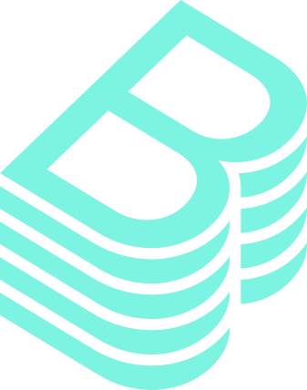 | [Explore](21-Multi-Tenancy-and-Platform-Engineering/) |
| cert-manager |  | [Explore](14-Security-Policy-and-Supply-Chain/) |
| cilium | 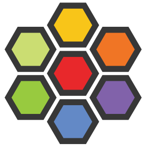 | [Explore](10-Networking-CNI-and-Service-Discovery/) |
| clusternet | 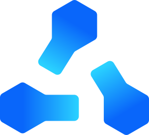 | [Explore](37-Ecosystem-and-Extension-Resource-Catalog/) |
| containerd |  | [Explore](05-Nodes-Runtimes-and-Operating-Systems/) |
| crio |  | [Explore](05-Nodes-Runtimes-and-Operating-Systems/) |
| crossplane |  | [Explore](21-Multi-Tenancy-and-Platform-Engineering/) |
| docker |  | [Explore](05-Nodes-Runtimes-and-Operating-Systems/) |
| envoy |  | [Explore](19-Service-Mesh-and-Advanced-Traffic/) |
| falco | 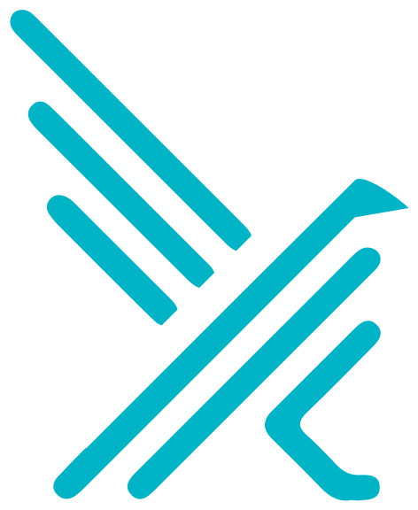 | [Explore](14-Security-Policy-and-Supply-Chain/) |
| fluentd |  | [Explore](15-Observability-Metrics-Logs-and-Traces/) |
| flux |  | [Explore](18-CI-CD-GitOps-and-Progressive-Delivery/) |
| git |  | [Explore](37-Ecosystem-and-Extension-Resource-Catalog/) |
| grafana |  | [Explore](15-Observability-Metrics-Logs-and-Traces/) |
| harbor |  | [Explore](37-Ecosystem-and-Extension-Resource-Catalog/) |
| helm |  | [Explore](17-Helm-Kustomize-and-Package-Management/) |
| istio |  | [Explore](19-Service-Mesh-and-Advanced-Traffic/) |
| jaeger |  | [Explore](15-Observability-Metrics-Logs-and-Traces/) |
| jenkins |  | [Explore](18-CI-CD-GitOps-and-Progressive-Delivery/) |
| keda | 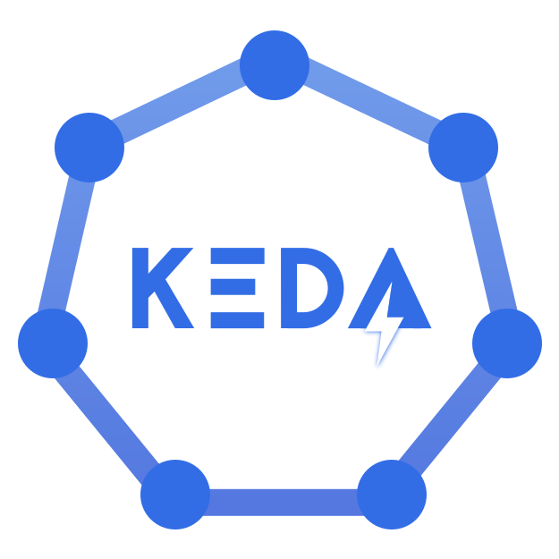 | [Explore](16-Autoscaling-Capacity-and-Performance/) |
| knative | 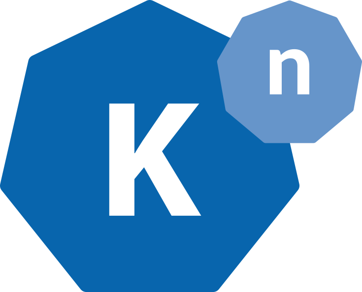 | [Explore](37-Ecosystem-and-Extension-Resource-Catalog/) |
| kubeflow | 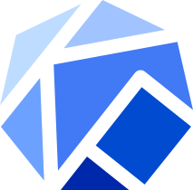 | [Explore](29-Specialized-Workloads/) |
| kubernetes |  | [Explore](37-Ecosystem-and-Extension-Resource-Catalog/) |
| kubevirt | 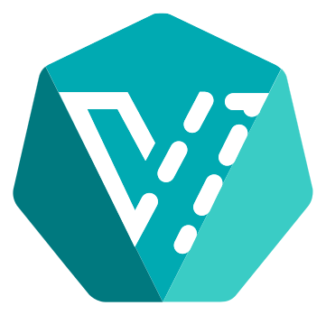 | [Explore](29-Specialized-Workloads/) |
| kyverno | 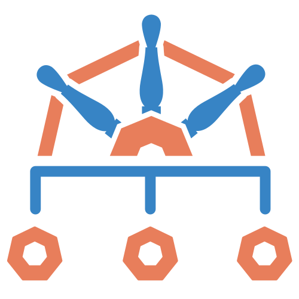 | [Explore](14-Security-Policy-and-Supply-Chain/) |
| linkerd | 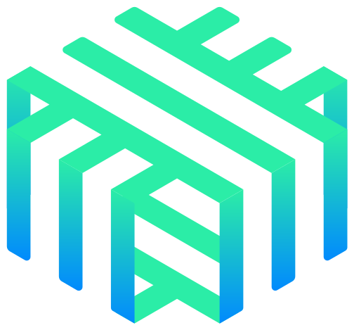 | [Explore](19-Service-Mesh-and-Advanced-Traffic/) |
| longhorn | 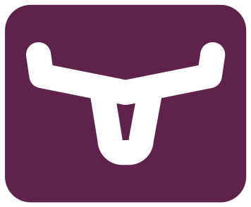 | [Explore](37-Ecosystem-and-Extension-Resource-Catalog/) |
| opencost |  | [Explore](28-Cost-Management-and-FinOps/) |
| opentelemetry |  | [Explore](15-Observability-Metrics-Logs-and-Traces/) |
| prometheus |  | [Explore](15-Observability-Metrics-Logs-and-Traces/) |
| python |  | [Explore](37-Ecosystem-and-Extension-Resource-Catalog/) |
| rook | 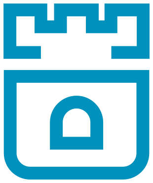 | [Explore](37-Ecosystem-and-Extension-Resource-Catalog/) |
| tekton | 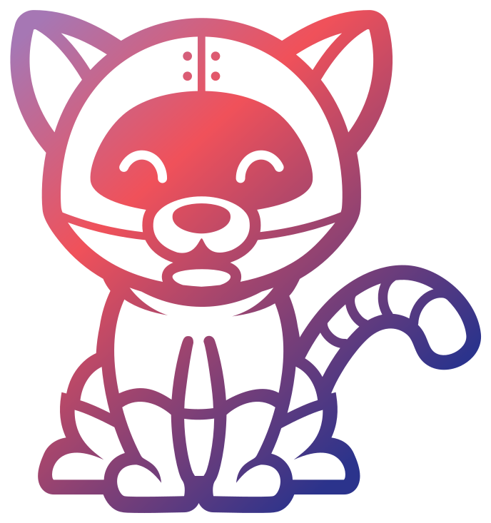 | [Explore](18-CI-CD-GitOps-and-Progressive-Delivery/) |
| velero |  | [Explore](24-Reliability-Backup-and-Disaster-Recovery/) |
| vitess |  | [Explore](29-Specialized-Workloads/) |
| volcano |  | [Explore](29-Specialized-Workloads/) |

## Extension resource catalogue

| Extension | Example resource kinds | Directory |
|---|---|---|
| Gateway-API | GatewayClass, Gateway, HTTPRoute, GRPCRoute, TLSRoute, TCPRoute, UDPRoute, ReferenceGrant, BackendTLSPolicy | [Browse](37-Ecosystem-and-Extension-Resource-Catalog/Gateway-API/) |
| CSI-Snapshots | VolumeSnapshot, VolumeSnapshotContent, VolumeSnapshotClass | [Browse](37-Ecosystem-and-Extension-Resource-Catalog/CSI-Snapshots/) |
| Prometheus-Operator | Prometheus, Alertmanager, ServiceMonitor, PodMonitor, PrometheusRule, Probe, ScrapeConfig | [Browse](37-Ecosystem-and-Extension-Resource-Catalog/Prometheus-Operator/) |
| cert-manager | Certificate, CertificateRequest, Issuer, ClusterIssuer, Order, Challenge | [Browse](37-Ecosystem-and-Extension-Resource-Catalog/cert-manager/) |
| Argo-CD | Application, ApplicationSet, AppProject | [Browse](37-Ecosystem-and-Extension-Resource-Catalog/Argo-CD/) |
| Flux | GitRepository, OCIRepository, HelmRepository, Kustomization, HelmRelease, ImageRepository, ImagePolicy, ImageUpdateAutomation | [Browse](37-Ecosystem-and-Extension-Resource-Catalog/Flux/) |
| Kyverno | Policy, ClusterPolicy, PolicyException | [Browse](37-Ecosystem-and-Extension-Resource-Catalog/Kyverno/) |
| Cilium | CiliumNetworkPolicy, CiliumClusterwideNetworkPolicy, CiliumEndpoint | [Browse](37-Ecosystem-and-Extension-Resource-Catalog/Cilium/) |
| Istio | VirtualService, DestinationRule, Gateway, ServiceEntry, AuthorizationPolicy, PeerAuthentication | [Browse](37-Ecosystem-and-Extension-Resource-Catalog/Istio/) |
| Crossplane | Composition, CompositeResourceDefinition, Provider, ProviderConfig | [Browse](37-Ecosystem-and-Extension-Resource-Catalog/Crossplane/) |
| KEDA | ScaledObject, ScaledJob, TriggerAuthentication, ClusterTriggerAuthentication | [Browse](37-Ecosystem-and-Extension-Resource-Catalog/KEDA/) |

## Cluster architecture visual

[View the control plane and worker-node diagram](assets/diagrams/cluster-architecture.png).

[Browse API subresource operations](36-Kubernetes-API-Resource-Catalog/Subresources/). The exact source schema is included in `docs/KUBERNETES-OPENAPI.json`.

## Choose a learning path

| Goal | Suggested focus |
|---|---|
| Start with Kubernetes | Foundations, local clusters, kubectl, Pods, Deployments, Services |
| Build applications | Workloads, configuration, networking, storage, Helm, delivery |
| Administer clusters | Architecture, lifecycle, nodes, access, backup, upgrades |
| Work in security | Identity, RBAC, admission, policy, secrets, supply chain |
| Operate production | Observability, capacity, reliability, incident response |
| Build platforms | GitOps, operators, tenancy, managed clusters, platform APIs |

## Coverage and compatibility

Kubernetes World covers the core API snapshot and broad engineering domains. Kubernetes can be extended through CRDs and aggregated APIs, so no fixed directory can enumerate every possible resource. Gateway API, CSI snapshots, service meshes, and operator resources remain separate from built-in APIs.

Alpha and beta versions in the source specification do not establish that an API is enabled. Verify the installed cluster version, feature gates, runtime configuration, and extension releases. Legacy subjects belong in migration context rather than new-installation instructions.

## References and visual credits

- [Kubernetes API reference](https://kubernetes.io/docs/reference/kubernetes-api/)
- [Kubernetes concepts](https://kubernetes.io/docs/concepts/)
- [Kubernetes release information](https://kubernetes.io/releases/)
- [Local asset attribution](assets/ATTRIBUTION.md)

## VERIQTA

Practical engineering starts with understanding the system, gathering evidence, and verifying the result. Star Kubernetes World to follow new learning materials.
