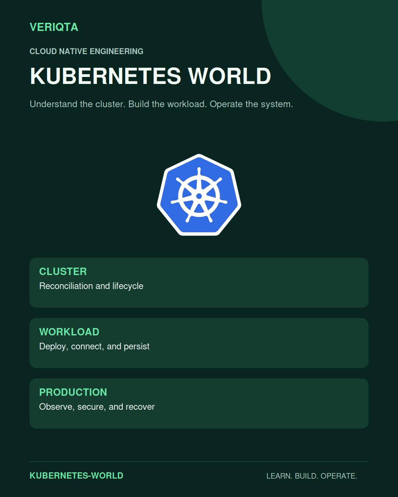
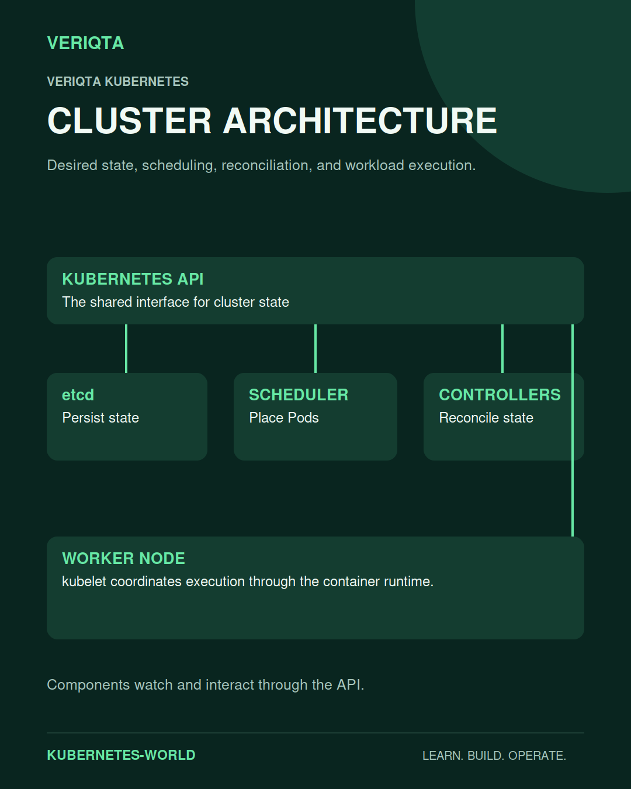
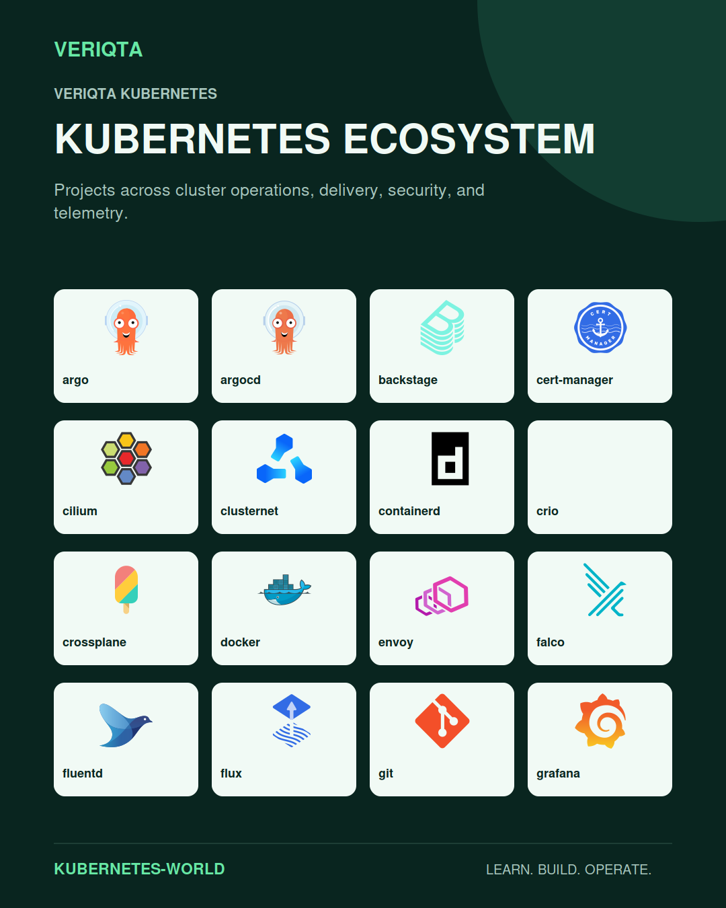
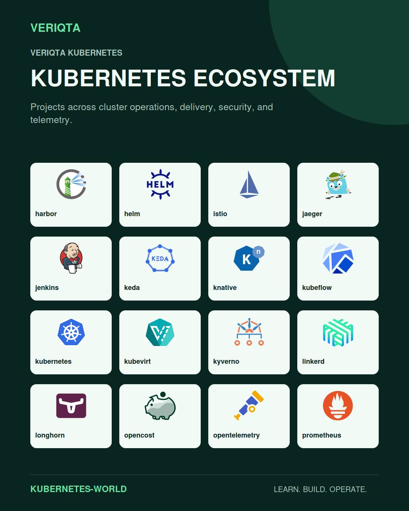
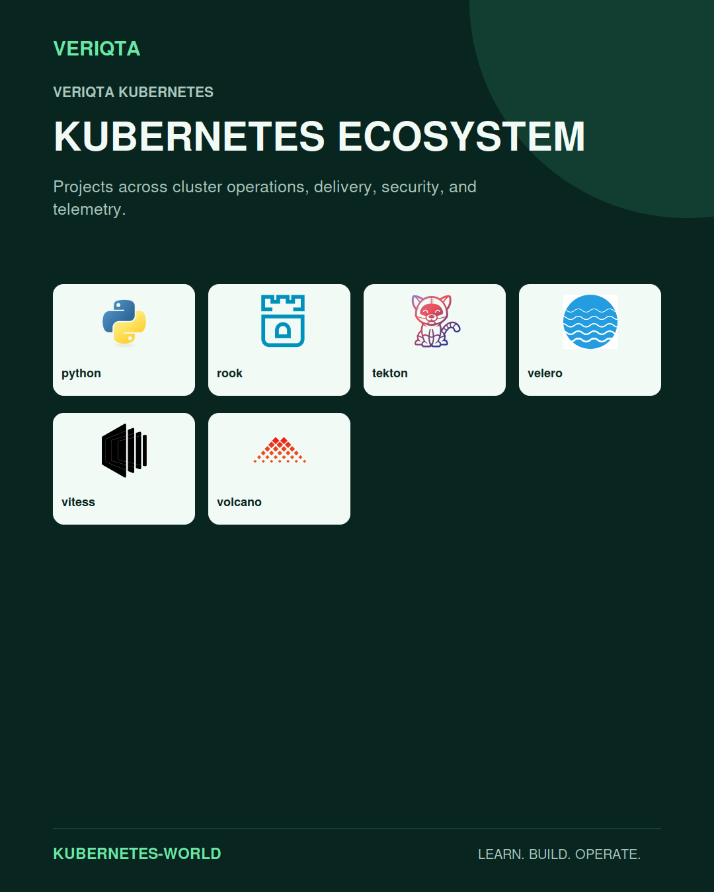
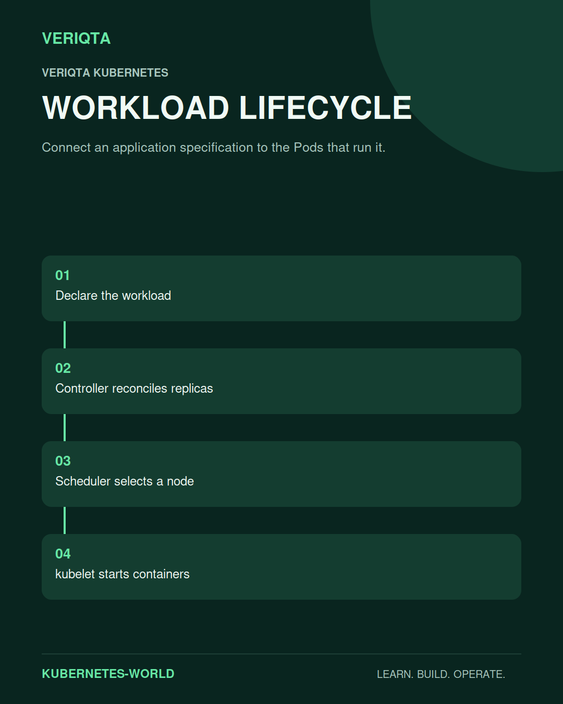
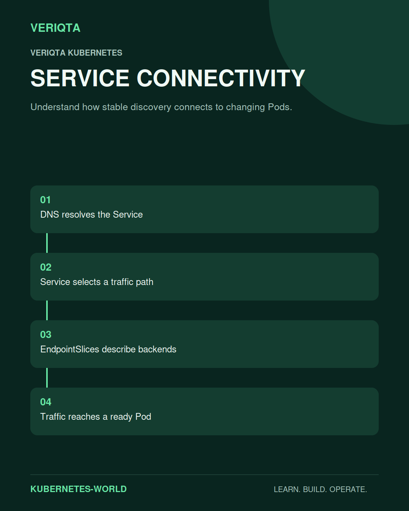
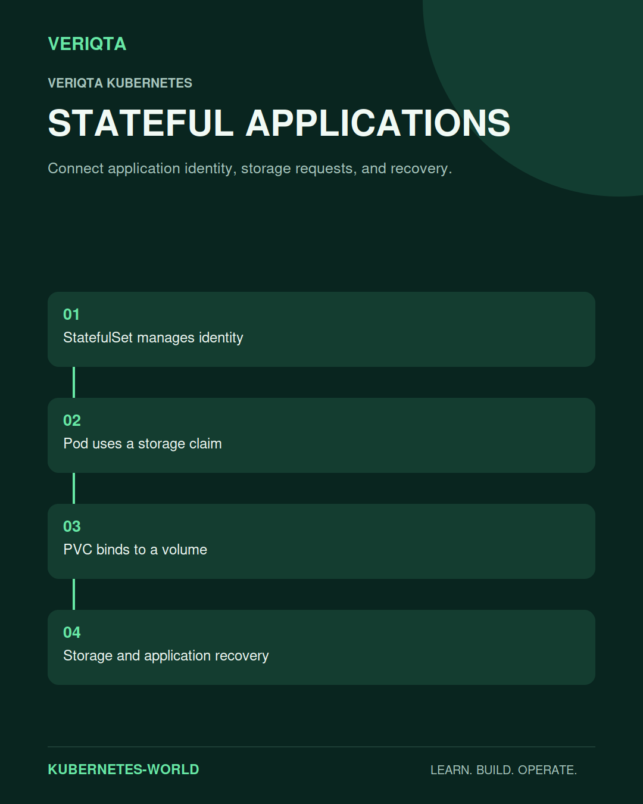

# KUBERNETES-WORLD

### Understand the cluster. Build the workload. Operate the system.

KUBERNETES-WORLD is VERIQTA's learning and reference hub for Kubernetes engineering. Explore the platform from declarative state and reconciliation to workload design, networking, storage, security, observability, and production operations.

Understand how the cluster behaves, how its resources fit together, and how to investigate failures with evidence. Connect individual objects to the applications, platforms, and operating decisions they support.

## Choose your starting point

| Your goal | Explore |
| :--- | :--- |
| Learn Kubernetes from the beginning | [Learning paths](01-Beginner-to-Advanced/) and [foundations](02-Cloud-Native-and-Kubernetes-Foundations/) |
| Understand the control plane and nodes | [Cluster architecture](03-Cluster-Architecture-and-Control-Plane/) and [node operations](05-Nodes-Runtimes-and-Operating-Systems/) |
| Deploy and manage an application | [Workloads](07-Workloads-and-Controllers/) and [configuration](08-Configuration-Secrets-and-Application-Lifecycle/) |
| Connect and expose services | [Networking](10-Networking-CNI-and-Service-Discovery/) and [Ingress and Gateway API](11-Ingress-Gateway-API-and-Traffic-Management/) |
| Operate stateful systems | [Storage and CSI](12-Storage-CSI-and-Stateful-Applications/) |
| Secure access and workloads | [Identity and RBAC](13-Identity-RBAC-and-Access-Control/) and [security](14-Security-Policy-and-Supply-Chain/) |
| Investigate a production failure | [Observability](15-Observability-Metrics-Logs-and-Traces/) and [troubleshooting](26-Troubleshooting-and-Incident-Response/) |
| Build practical experience | [Labs](31-Labs/) and [projects](30-Projects/) |
| Prepare for interviews or certification | [Interview preparation](32-Interview-Preparation/) and [certification](33-Certification-Preparation/) |

## Explore the complete learning catalogue

Study the subjects in sequence or go directly to the engineering problem you need to understand.

| Subject | Engineering focus |
| :--- | :--- |
| [Start Here](00-Start-Here/) | How to Use, Learning Paths, Lab Environments, Version and Compatibility Guide, Cost and Cleanup, Evidence and Redaction. |
| [Beginner to Advanced](01-Beginner-to-Advanced/) | Beginner Track, Intermediate Track, Advanced Track, Skills Checklist. |
| [Cloud Native and Kubernetes Foundations](02-Cloud-Native-and-Kubernetes-Foundations/) | Containers and Orchestration, Declarative State, Reconciliation, Labels and Selectors, Namespaces, API Groups and Versions, Object Metadata, Ownership and Garbage Collection. |
| [Cluster Architecture and Control Plane](03-Cluster-Architecture-and-Control-Plane/) | API Server, etcd, Scheduler, Controller Manager, Cloud Controller Manager, Control Plane High Availability, Leader Election, Cluster Communication. |
| [Installation Bootstrap and Cluster Lifecycle](04-Installation-Bootstrap-and-Cluster-Lifecycle/) | kubeadm, kind, minikube, k3s, Talos, Bootstrap, Certificates, Cluster Upgrades, Version Skew, Cluster API, Node Join and Removal. |
| [Nodes Runtimes and Operating Systems](05-Nodes-Runtimes-and-Operating-Systems/) | kubelet, Container Runtime Interface, containerd, CRI O, RuntimeClass, Node Lifecycle, Linux and cgroups, Windows Nodes, Node Resource Managers, Node Problem Detection. |
| [Kubectl API and Client Tools](06-Kubectl-API-and-Client-Tools/) | kubeconfig, Contexts, API Discovery, kubectl Get and Describe, Logs Exec and Debug, Apply Patch and Replace, Server Side Apply, Watches and ResourceVersions, Client Libraries, API Access. |
| [Workloads and Controllers](07-Workloads-and-Controllers/) | Pods, Deployments, ReplicaSets, StatefulSets, DaemonSets, Jobs, CronJobs, ReplicationControllers, Init Containers, Sidecars, Lifecycle Hooks, Rollouts and Rollbacks. |
| [Configuration Secrets and Application Lifecycle](08-Configuration-Secrets-and-Application-Lifecycle/) | ConfigMaps, Secrets, Environment and Volumes, Configuration Reload, Probes, Graceful Termination, Pod Lifecycle, Application Dependencies, Image Pull Credentials. |
| [Scheduling Placement and Resource Management](09-Scheduling-Placement-and-Resource-Management/) | Requests and Limits, Affinity and Anti Affinity, Taints and Tolerations, Topology Spread, Priority and Preemption, Scheduler Configuration, ResourceQuota, LimitRange, PodDisruptionBudget, Dynamic Resource Allocation. |
| [Networking CNI and Service Discovery](10-Networking-CNI-and-Service-Discovery/) | Pod Networking, Services, EndpointSlices, CoreDNS, kube proxy, CNI, Calico, Cilium, NetworkPolicy, Dual Stack, Egress, Network Diagnostics. |
| [Ingress Gateway API and Traffic Management](11-Ingress-Gateway-API-and-Traffic-Management/) | Ingress, IngressClass, GatewayClass, Gateway, HTTPRoute, GRPCRoute, TLSRoute, TCPRoute, UDPRoute, ReferenceGrant, TLS and Certificates, Traffic Splitting, Controller Selection, Ingress NGINX Legacy and Migration. |
| [Storage CSI and Stateful Applications](12-Storage-CSI-and-Stateful-Applications/) | Volumes, PersistentVolumes, PersistentVolumeClaims, StorageClass, CSI, CSIDriver, CSINode, VolumeAttachment, Snapshots, Expansion, Access Modes, Stateful Recovery, Database Operators. |
| [Identity RBAC and Access Control](13-Identity-RBAC-and-Access-Control/) | ServiceAccounts, Authentication, Authorization, Roles, RoleBindings, ClusterRoles, ClusterRoleBindings, Tokens, OIDC, CertificateSigningRequests, Cloud Workload Identity. |
| [Security Policy and Supply Chain](14-Security-Policy-and-Supply-Chain/) | Pod Security Standards, SecurityContext, Admission Policy, Kyverno, OPA Gatekeeper, Secrets Encryption, Image Scanning, Signing and Provenance, Runtime Security, Falco, Trivy, Threat Modeling. |
| [Observability Metrics Logs and Traces](15-Observability-Metrics-Logs-and-Traces/) | Prometheus, Grafana, kube state metrics, Metrics Server, OpenTelemetry, Loki, Fluent Bit, Jaeger, Tempo, Alertmanager, Audit Logs, Service Level Indicators. |
| [Autoscaling Capacity and Performance](16-Autoscaling-Capacity-and-Performance/) | Horizontal Pod Autoscaling, Vertical Pod Autoscaling, Cluster Autoscaler, Karpenter, KEDA, Custom and External Metrics, Capacity Planning, Load Testing, CPU Throttling, Memory Pressure. |
| [Helm Kustomize and Package Management](17-Helm-Kustomize-and-Package-Management/) | Helm Charts, Values and Templates, Chart Dependencies, Release Management, OCI Registries, Kustomize Bases and Overlays, Patches, Generators, Manifest Validation. |
| [CI CD GitOps and Progressive Delivery](18-CI-CD-GitOps-and-Progressive-Delivery/) | Argo CD, Flux, Jenkins, GitHub Actions, GitLab CI, Tekton, Argo Rollouts, Flagger, Canary and Blue Green, Deployment Gates, GitOps Recovery. |
| [Service Mesh and Advanced Traffic](19-Service-Mesh-and-Advanced-Traffic/) | Istio, Linkerd, Envoy, Mutual TLS, Traffic Policy, Telemetry, Ambient and Sidecar Models, Mesh Troubleshooting. |
| [CRDs Operators and API Extensions](20-CRDs-Operators-and-API-Extensions/) | CustomResourceDefinitions, Custom Resources, Operators, Kubebuilder, Operator SDK, Admission Webhooks, Conversion Webhooks, Aggregated APIs, APIService, Finalizers, Controller Testing. |
| [Multi Tenancy and Platform Engineering](21-Multi-Tenancy-and-Platform-Engineering/) | Namespace Tenancy, Isolation Boundaries, Resource Quotas, Policy Enforcement, Self Service, Backstage, Crossplane, Platform APIs, Developer Experience. |
| [Managed Kubernetes and Cloud Integration](22-Managed-Kubernetes-and-Cloud-Integration/) | Amazon EKS, Azure AKS, Google GKE, Cloud Networking, Cloud Storage, Load Balancer Controllers, Workload Identity, Managed Control Planes, Cloud Costs. |
| [On Premises Hybrid Edge and Windows](23-On-Premises-Hybrid-Edge-and-Windows/) | Bare Metal, MetalLB, k3s, Edge Connectivity, Hybrid Networking, Disconnected Clusters, Windows Workloads, Multi Architecture Images. |
| [Reliability Backup and Disaster Recovery](24-Reliability-Backup-and-Disaster-Recovery/) | etcd Backups, Velero, Application Backups, Restore Testing, Failure Domains, Recovery Objectives, Control Plane Recovery, Cluster Rebuilds. |
| [Production Operations and CloudOps](25-Production-Operations-and-CloudOps/) | Operational Readiness, Runbooks, Change Management, Certificates and Rotation, Node Maintenance, Patch and Upgrade, Incident Response, Audit Evidence. |
| [Troubleshooting and Incident Response](26-Troubleshooting-and-Incident-Response/) | CrashLoopBackOff, ImagePullBackOff, Pending Pods, OOMKilled, DNS Failures, Service Connectivity, Ingress Failures, Storage Failures, Node NotReady, Control Plane Failures, Admission Failures, etcd Latency. |
| [Architecture Patterns](27-Architecture-Patterns/) | Stateless Web, Stateful Service, Event Driven, Batch and Scheduled, Multi Tenant, Private Platform, Multi Cluster, GitOps Platform, Observability Stack. |
| [Cost Management and FinOps](28-Cost-Management-and-FinOps/) | Resource Efficiency, Rightsizing, Node Utilization, Idle Resources, Storage and Network Costs, Kubecost, OpenCost, Cost Allocation. |
| [Specialized Workloads](29-Specialized-Workloads/) | GPU and Accelerators, AI and ML, Distributed Training, Batch and HPC, Data Platforms, Real Time Applications, DRA, Device Plugins, Topology Management. |
| [Projects](30-Projects/) | Junior, Mid Level, Senior, Portfolio Capstones. |
| [Labs](31-Labs/) | Junior, Mid Level, Senior. |
| [Interview Preparation](32-Interview-Preparation/) | Junior, Mid Level, Senior, Architecture Discussions. |
| [Certification Preparation](33-Certification-Preparation/) | CKA, CKAD, CKS, KCNA, KCSA. |
| [Engineer Notebooks](34-Engineer-Notebooks/) | Notebook Standards, Evidence and Redaction, Junior, Mid Level, Senior, Shared Templates. |
| [Toolkit and Automation](35-Toolkit-and-Automation/) | kubectl Cheat Sheets, Shell Scripts, Python Clients, Manifest Templates, Helm Templates, Kustomize Templates, Diagnostics, Cleanup Checklists. |
| [Kubernetes API Resource Catalog](36-Kubernetes-API-Resource-Catalog/) | API Discovery, Scope and Versions, Deprecations and Migrations. |
| [Ecosystem and Extension Resource Catalog](37-Ecosystem-and-Extension-Resource-Catalog/) | Gateway API, CSI Snapshots, Prometheus Operator, cert manager, Argo CD, Flux, Kyverno, Cilium, Istio, Crossplane, KEDA. |
| [Resources and Official References](38-Resources-and-Official-References/) | Official Documentation, API Reference, Release Notes, Enhancement Proposals, Community and SIGs. |
| [Versioning Compatibility and Deprecations](39-Versioning-Compatibility-and-Deprecations/) | Supported Versions, Feature Gates, API Availability, Upgrade Compatibility, Component Compatibility, Deprecated APIs, Extension Version Matrix. |

## Understand the cluster

The Kubernetes API connects the components that persist state, schedule Pods, reconcile resources, and execute workloads. Follow these relationships when reasoning about behaviour or investigating a failure.

## Kubernetes API resource catalogue

Explore resources by kind, API group, version, and scope. Use cluster API discovery and compatibility guidance to establish which resources are available in your environment. Some kinds represent requests or reviews rather than persistent workload objects.

| Resource kind | Icon | API group | Versions | Scope | Learn |
|---|---|---|---|---|---|
| MutatingAdmissionPolicy |  | `admissionregistration.k8s.io` | v1, v1alpha1, v1beta1 | Cluster | [Explore](36-Kubernetes-API-Resource-Catalog/admissionregistration-k8s-io/MutatingAdmissionPolicy/) |
| MutatingAdmissionPolicyBinding |  | `admissionregistration.k8s.io` | v1, v1alpha1, v1beta1 | Cluster | [Explore](36-Kubernetes-API-Resource-Catalog/admissionregistration-k8s-io/MutatingAdmissionPolicyBinding/) |
| MutatingWebhookConfiguration |  | `admissionregistration.k8s.io` | v1 | Cluster | [Explore](36-Kubernetes-API-Resource-Catalog/admissionregistration-k8s-io/MutatingWebhookConfiguration/) |
| ValidatingAdmissionPolicy |  | `admissionregistration.k8s.io` | v1 | Cluster | [Explore](36-Kubernetes-API-Resource-Catalog/admissionregistration-k8s-io/ValidatingAdmissionPolicy/) |
| ValidatingAdmissionPolicyBinding |  | `admissionregistration.k8s.io` | v1 | Cluster | [Explore](36-Kubernetes-API-Resource-Catalog/admissionregistration-k8s-io/ValidatingAdmissionPolicyBinding/) |
| ValidatingWebhookConfiguration |  | `admissionregistration.k8s.io` | v1 | Cluster | [Explore](36-Kubernetes-API-Resource-Catalog/admissionregistration-k8s-io/ValidatingWebhookConfiguration/) |
| CustomResourceDefinition |  | `apiextensions.k8s.io` | v1 | Cluster | [Explore](36-Kubernetes-API-Resource-Catalog/apiextensions-k8s-io/CustomResourceDefinition/) |
| APIService |  | `apiregistration.k8s.io` | v1 | Cluster | [Explore](36-Kubernetes-API-Resource-Catalog/apiregistration-k8s-io/APIService/) |
| ControllerRevision |  | `apps` | v1 | Namespaced | [Explore](36-Kubernetes-API-Resource-Catalog/apps/ControllerRevision/) |
| DaemonSet |  | `apps` | v1 | Namespaced | [Explore](36-Kubernetes-API-Resource-Catalog/apps/DaemonSet/) |
| Deployment |  | `apps` | v1 | Namespaced | [Explore](36-Kubernetes-API-Resource-Catalog/apps/Deployment/) |
| ReplicaSet |  | `apps` | v1 | Namespaced | [Explore](36-Kubernetes-API-Resource-Catalog/apps/ReplicaSet/) |
| StatefulSet |  | `apps` | v1 | Namespaced | [Explore](36-Kubernetes-API-Resource-Catalog/apps/StatefulSet/) |
| SelfSubjectReview |  | `authentication.k8s.io` | v1 | Cluster | [Explore](36-Kubernetes-API-Resource-Catalog/authentication-k8s-io/SelfSubjectReview/) |
| TokenReview |  | `authentication.k8s.io` | v1 | Cluster | [Explore](36-Kubernetes-API-Resource-Catalog/authentication-k8s-io/TokenReview/) |
| LocalSubjectAccessReview |  | `authorization.k8s.io` | v1 | Namespaced | [Explore](36-Kubernetes-API-Resource-Catalog/authorization-k8s-io/LocalSubjectAccessReview/) |
| SelfSubjectAccessReview |  | `authorization.k8s.io` | v1 | Cluster | [Explore](36-Kubernetes-API-Resource-Catalog/authorization-k8s-io/SelfSubjectAccessReview/) |
| SelfSubjectRulesReview |  | `authorization.k8s.io` | v1 | Cluster | [Explore](36-Kubernetes-API-Resource-Catalog/authorization-k8s-io/SelfSubjectRulesReview/) |
| SubjectAccessReview |  | `authorization.k8s.io` | v1 | Cluster | [Explore](36-Kubernetes-API-Resource-Catalog/authorization-k8s-io/SubjectAccessReview/) |
| HorizontalPodAutoscaler |  | `autoscaling` | v1, v2 | Namespaced | [Explore](36-Kubernetes-API-Resource-Catalog/autoscaling/HorizontalPodAutoscaler/) |
| CronJob |  | `batch` | v1 | Namespaced | [Explore](36-Kubernetes-API-Resource-Catalog/batch/CronJob/) |
| Job |  | `batch` | v1 | Namespaced | [Explore](36-Kubernetes-API-Resource-Catalog/batch/Job/) |
| CertificateSigningRequest |  | `certificates.k8s.io` | v1 | Cluster | [Explore](36-Kubernetes-API-Resource-Catalog/certificates-k8s-io/CertificateSigningRequest/) |
| ClusterTrustBundle |  | `certificates.k8s.io` | v1, v1beta1 | Cluster | [Explore](36-Kubernetes-API-Resource-Catalog/certificates-k8s-io/ClusterTrustBundle/) |
| PodCertificateRequest |  | `certificates.k8s.io` | v1, v1beta1 | Namespaced | [Explore](36-Kubernetes-API-Resource-Catalog/certificates-k8s-io/PodCertificateRequest/) |
| Lease |  | `coordination.k8s.io` | v1 | Namespaced | [Explore](36-Kubernetes-API-Resource-Catalog/coordination-k8s-io/Lease/) |
| LeaseCandidate |  | `coordination.k8s.io` | v1alpha2, v1beta1 | Namespaced | [Explore](36-Kubernetes-API-Resource-Catalog/coordination-k8s-io/LeaseCandidate/) |
| Binding |  | `core` | v1 | Namespaced | [Explore](36-Kubernetes-API-Resource-Catalog/core/Binding/) |
| ComponentStatus |  | `core` | v1 | Cluster | [Explore](36-Kubernetes-API-Resource-Catalog/core/ComponentStatus/) |
| ConfigMap |  | `core` | v1 | Namespaced | [Explore](36-Kubernetes-API-Resource-Catalog/core/ConfigMap/) |
| Endpoints |  | `core` | v1 | Namespaced | [Explore](36-Kubernetes-API-Resource-Catalog/core/Endpoints/) |
| Event |  | `core` | v1 | Namespaced | [Explore](36-Kubernetes-API-Resource-Catalog/core/Event/) |
| LimitRange |  | `core` | v1 | Namespaced | [Explore](36-Kubernetes-API-Resource-Catalog/core/LimitRange/) |
| Namespace |  | `core` | v1 | Cluster | [Explore](36-Kubernetes-API-Resource-Catalog/core/Namespace/) |
| Node |  | `core` | v1 | Cluster | [Explore](36-Kubernetes-API-Resource-Catalog/core/Node/) |
| PersistentVolume |  | `core` | v1 | Cluster | [Explore](36-Kubernetes-API-Resource-Catalog/core/PersistentVolume/) |
| PersistentVolumeClaim |  | `core` | v1 | Namespaced | [Explore](36-Kubernetes-API-Resource-Catalog/core/PersistentVolumeClaim/) |
| Pod |  | `core` | v1 | Namespaced | [Explore](36-Kubernetes-API-Resource-Catalog/core/Pod/) |
| PodTemplate |  | `core` | v1 | Namespaced | [Explore](36-Kubernetes-API-Resource-Catalog/core/PodTemplate/) |
| ReplicationController |  | `core` | v1 | Namespaced | [Explore](36-Kubernetes-API-Resource-Catalog/core/ReplicationController/) |
| ResourceQuota |  | `core` | v1 | Namespaced | [Explore](36-Kubernetes-API-Resource-Catalog/core/ResourceQuota/) |
| Secret |  | `core` | v1 | Namespaced | [Explore](36-Kubernetes-API-Resource-Catalog/core/Secret/) |
| Service |  | `core` | v1 | Namespaced | [Explore](36-Kubernetes-API-Resource-Catalog/core/Service/) |
| ServiceAccount |  | `core` | v1 | Namespaced | [Explore](36-Kubernetes-API-Resource-Catalog/core/ServiceAccount/) |
| EndpointSlice |  | `discovery.k8s.io` | v1 | Namespaced | [Explore](36-Kubernetes-API-Resource-Catalog/discovery-k8s-io/EndpointSlice/) |
| Event |  | `events.k8s.io` | v1 | Namespaced | [Explore](36-Kubernetes-API-Resource-Catalog/events-k8s-io/Event/) |
| FlowSchema |  | `flowcontrol.apiserver.k8s.io` | v1 | Cluster | [Explore](36-Kubernetes-API-Resource-Catalog/flowcontrol-apiserver-k8s-io/FlowSchema/) |
| PriorityLevelConfiguration |  | `flowcontrol.apiserver.k8s.io` | v1 | Cluster | [Explore](36-Kubernetes-API-Resource-Catalog/flowcontrol-apiserver-k8s-io/PriorityLevelConfiguration/) |
| StorageVersion |  | `internal.apiserver.k8s.io` | v1alpha1 | Cluster | [Explore](36-Kubernetes-API-Resource-Catalog/internal-apiserver-k8s-io/StorageVersion/) |
| Eviction |  | `lifecycle.k8s.io` | v1alpha1 | Namespaced | [Explore](36-Kubernetes-API-Resource-Catalog/lifecycle-k8s-io/Eviction/) |
| EvictionRequest |  | `lifecycle.k8s.io` | v1alpha1 | Namespaced | [Explore](36-Kubernetes-API-Resource-Catalog/lifecycle-k8s-io/EvictionRequest/) |
| IPAddress |  | `networking.k8s.io` | v1 | Cluster | [Explore](36-Kubernetes-API-Resource-Catalog/networking-k8s-io/IPAddress/) |
| Ingress |  | `networking.k8s.io` | v1 | Namespaced | [Explore](36-Kubernetes-API-Resource-Catalog/networking-k8s-io/Ingress/) |
| IngressClass |  | `networking.k8s.io` | v1 | Cluster | [Explore](36-Kubernetes-API-Resource-Catalog/networking-k8s-io/IngressClass/) |
| NetworkPolicy |  | `networking.k8s.io` | v1 | Namespaced | [Explore](36-Kubernetes-API-Resource-Catalog/networking-k8s-io/NetworkPolicy/) |
| ServiceCIDR |  | `networking.k8s.io` | v1 | Cluster | [Explore](36-Kubernetes-API-Resource-Catalog/networking-k8s-io/ServiceCIDR/) |
| RuntimeClass |  | `node.k8s.io` | v1 | Cluster | [Explore](36-Kubernetes-API-Resource-Catalog/node-k8s-io/RuntimeClass/) |
| PodDisruptionBudget |  | `policy` | v1 | Namespaced | [Explore](36-Kubernetes-API-Resource-Catalog/policy/PodDisruptionBudget/) |
| ClusterRole |  | `rbac.authorization.k8s.io` | v1 | Cluster | [Explore](36-Kubernetes-API-Resource-Catalog/rbac-authorization-k8s-io/ClusterRole/) |
| ClusterRoleBinding |  | `rbac.authorization.k8s.io` | v1 | Cluster | [Explore](36-Kubernetes-API-Resource-Catalog/rbac-authorization-k8s-io/ClusterRoleBinding/) |
| Role |  | `rbac.authorization.k8s.io` | v1 | Namespaced | [Explore](36-Kubernetes-API-Resource-Catalog/rbac-authorization-k8s-io/Role/) |
| RoleBinding |  | `rbac.authorization.k8s.io` | v1 | Namespaced | [Explore](36-Kubernetes-API-Resource-Catalog/rbac-authorization-k8s-io/RoleBinding/) |
| DeviceClass |  | `resource.k8s.io` | v1, v1beta1, v1beta2 | Cluster | [Explore](36-Kubernetes-API-Resource-Catalog/resource-k8s-io/DeviceClass/) |
| DeviceTaintRule |  | `resource.k8s.io` | v1, v1alpha3, v1beta2 | Cluster | [Explore](36-Kubernetes-API-Resource-Catalog/resource-k8s-io/DeviceTaintRule/) |
| ResourceClaim |  | `resource.k8s.io` | v1, v1beta1, v1beta2 | Namespaced | [Explore](36-Kubernetes-API-Resource-Catalog/resource-k8s-io/ResourceClaim/) |
| ResourceClaimTemplate |  | `resource.k8s.io` | v1, v1beta1, v1beta2 | Namespaced | [Explore](36-Kubernetes-API-Resource-Catalog/resource-k8s-io/ResourceClaimTemplate/) |
| ResourcePoolStatusRequest |  | `resource.k8s.io` | v1alpha3 | Cluster | [Explore](36-Kubernetes-API-Resource-Catalog/resource-k8s-io/ResourcePoolStatusRequest/) |
| ResourceSlice |  | `resource.k8s.io` | v1, v1beta1, v1beta2 | Cluster | [Explore](36-Kubernetes-API-Resource-Catalog/resource-k8s-io/ResourceSlice/) |
| CompositePodGroup |  | `scheduling.k8s.io` | v1alpha3 | Namespaced | [Explore](36-Kubernetes-API-Resource-Catalog/scheduling-k8s-io/CompositePodGroup/) |
| PodGroup |  | `scheduling.k8s.io` | v1alpha3, v1beta1 | Namespaced | [Explore](36-Kubernetes-API-Resource-Catalog/scheduling-k8s-io/PodGroup/) |
| PriorityClass |  | `scheduling.k8s.io` | v1 | Cluster | [Explore](36-Kubernetes-API-Resource-Catalog/scheduling-k8s-io/PriorityClass/) |
| Workload |  | `scheduling.k8s.io` | v1alpha3, v1beta1 | Namespaced | [Explore](36-Kubernetes-API-Resource-Catalog/scheduling-k8s-io/Workload/) |
| CSIDriver |  | `storage.k8s.io` | v1 | Cluster | [Explore](36-Kubernetes-API-Resource-Catalog/storage-k8s-io/CSIDriver/) |
| CSINode |  | `storage.k8s.io` | v1 | Cluster | [Explore](36-Kubernetes-API-Resource-Catalog/storage-k8s-io/CSINode/) |
| CSIStorageCapacity |  | `storage.k8s.io` | v1 | Namespaced | [Explore](36-Kubernetes-API-Resource-Catalog/storage-k8s-io/CSIStorageCapacity/) |
| StorageClass |  | `storage.k8s.io` | v1 | Cluster | [Explore](36-Kubernetes-API-Resource-Catalog/storage-k8s-io/StorageClass/) |
| VolumeAttachment |  | `storage.k8s.io` | v1 | Cluster | [Explore](36-Kubernetes-API-Resource-Catalog/storage-k8s-io/VolumeAttachment/) |
| VolumeAttributesClass |  | `storage.k8s.io` | v1 | Cluster | [Explore](36-Kubernetes-API-Resource-Catalog/storage-k8s-io/VolumeAttributesClass/) |
| StorageVersionMigration |  | `storagemigration.k8s.io` | v1, v1beta1 | Cluster | [Explore](36-Kubernetes-API-Resource-Catalog/storagemigration-k8s-io/StorageVersionMigration/) |

[Explore the API catalogue](36-Kubernetes-API-Resource-Catalog/) | [Versioning and compatibility](39-Versioning-Compatibility-and-Deprecations/)

## Extensions and ecosystem resources

Kubernetes extensions introduce their own APIs and operating models. Explore Gateway API, snapshots, observability operators, certificate management, GitOps, policy, networking, platform APIs, and autoscaling in their installation and version context.

[Explore extension resources](37-Ecosystem-and-Extension-Resource-Catalog/) | [CRDs and operators](20-CRDs-Operators-and-API-Extensions/)

## Connect resources to application behaviour

A workload specification, its controller, the scheduler, and the node runtime participate in different parts of the application lifecycle. Services and EndpointSlices connect traffic to backends. Storage claims connect applications to persistent volumes.

## Learn through engineering practice

1. Understand the resource and the behaviour it controls.
2. Apply a small change in a controlled environment.
3. Observe events, logs, metrics, and the resulting object state.
4. Introduce a failure and explain what the evidence shows.
5. Verify recovery and record the operational lesson.

For production changes, consider impact, permissions, rollback, capacity, and verification. Keep workload data and credentials out of shared evidence.

[Engineer notebooks](34-Engineer-Notebooks/) | [Toolkit and automation](35-Toolkit-and-Automation/) | [Production operations](25-Production-Operations-and-CloudOps/)

## Design for production

Connect scheduling, tenancy, identity, connectivity, state, delivery, and observability. Explore managed clusters, on-premises and edge systems, multi-cluster platforms, recovery, FinOps, and specialised GPU and data workloads.

[Architecture patterns](27-Architecture-Patterns/) | [Reliability and recovery](24-Reliability-Backup-and-Disaster-Recovery/) | [Platform engineering](21-Multi-Tenancy-and-Platform-Engineering/) | [Specialised workloads](29-Specialized-Workloads/)

## References and project information

[Official references](38-Resources-and-Official-References/) | [Contributing](CONTRIBUTING.md) | [Resource standard](RESOURCE-STANDARD.md) | [Roadmap](ROADMAP.md) | [Security](SECURITY.md) | [Support](SUPPORT.md) | [License](LICENSE)

Third-party project names and logos belong to their owners. Inclusion does not imply endorsement. See [asset sources](docs/ASSET-SOURCES.json).
